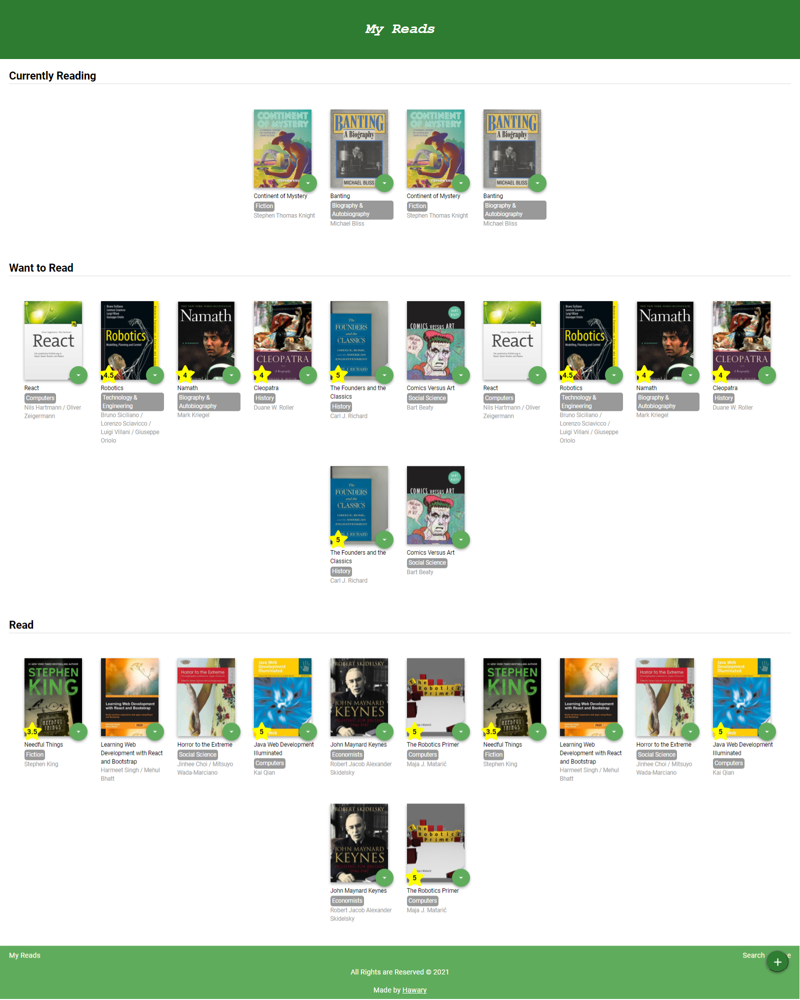

# My Reads

[](https://app.netlify.com/sites/myreads14/deploys)

My Reads is a book tracking App allows you to organize your books library in 3 shelfs: (Currently Read Shelf), (Want to Read Shelf) & (Read Shelf). It depends on the API of Booklender website.

You can view the App from [here](https://myreads14.netlify.app/)

 

## Demo

 https://user-images.githubusercontent.com/69651552/129760902-f9fbd7f9-24e3-4961-b977-fda6c4a45ffd.mp4

## Instructions, Building & Get Started

    - 1- Fork, clone or download this repository to your local machine.
    - 2- Be sure that you install the [Node.js](https://nodejs.org/en/) environment in your machine.
    - 3- Open your terminal and be sure that you are inside the correct destination of the App, while you must be in the same path of the package.json file.
    - 4- inside your terminal run these commands:-
    
        * to install dependencies.
        ```
        npm install
        ```
        * to start the server.
        ```
        npm start
        ```
    - 5- Once the App server is running visit (localhost:3000) in the browser to view the App and now you can treat with it as shown above in the Demo.
    - 6- You can also see a live preview of the App from this link (https://myreads14.netlify.app/)

## Built With

* HTML
* CSS
* JS

## Libraries & Packages

* [Fontawesome](https://fontawesome.com/)
* [PropTypes](https://www.npmjs.com/package/prop-types)
* [React Router](https://www.npmjs.com/package/react-router)
* [React Router Dom](https://www.npmjs.com/package/react-router-dom)

## Frameworks 

* [React.js](https://reactjs.org/)  

## API

* [Booklender](https://www.booklender.com/)

## Features

*  The control to move any book from a shelf to another shelf or remove it from all shelfs.
*  Search in a big library of many books at many categories, you can find your favorite book and add it into your own library at a specific shelf you choose.

## Author

* [Mohamed Elhawary](https://www.linkedin.com/in/mohamed-elhawary14/) 

## Contact me through my social accounts

* Email: mohamed.k.elhawary@gmail.com
* [LinkedIn](https://www.linkedin.com/in/mohamed-elhawary14/)
* [Github](https://github.com/Mohamed-Elhawary)  
* [Behance](https://www.behance.net/mohamed-elhawary14)
* [Codepen](https://codepen.io/Mohamed-ElHawary) 

## Notices

- This App is a practical project from Udacity Course [Nanodegree Program - Web Development Advanced Track](https://www.udacity.com/course/intro-to-programming-nanodegree--nd000)

## Certificate

[Course Certificate](Certificate.pdf)

## License

Licensed under the [MIT License](LICENSE)
